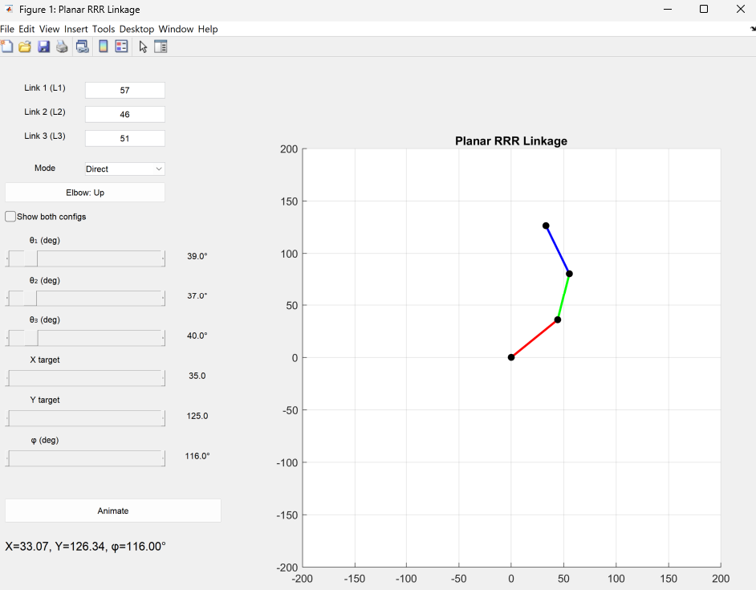

# Linkage Kinematic Models
Support files for the kinematic analysis of a few sample linkages:
- the planar RRR serial chain
- the planar fourbar linkage 
- the slider-crank linkage

Run xxx_gui.m from Matlab to open a graphical user interface through which you can move and animate the linkage. Direct and inverse kinematics functions can also be used standalon. All files are under the GNU Affero General Public License v3.0, see LICENSE file.
