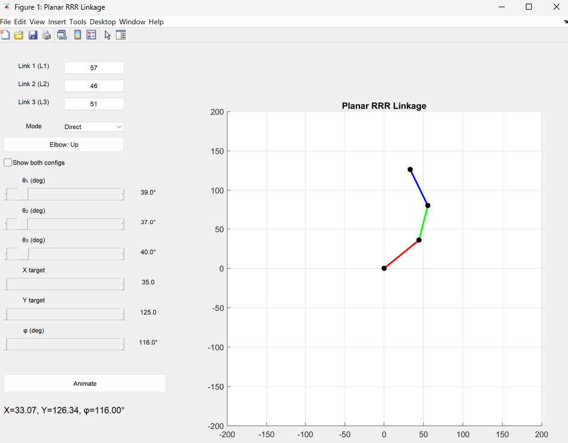

# Common Linkages' Kinematic Models — MEC6319 Course and More

Support files for the kinematic analysis of planar linkages studied in the MEC6319 course at Polytechnique Montréal. Each mechanism is provided with direct kinematics, inverse kinematics, a standalone plot function, and a fully interactive GUI — all in both **MATLAB/Octave** and **Python**.

## Mechanisms Included

| Mechanism | Direct Kinematics | Inverse Kinematics | Plot | GUI |
|---|---|---|---|---|
| Planar Four-Bar Linkage | ✓ | ✓ | ✓ | ✓ |
| Planar RRR Serial Chain | ✓ | ✓ | ✓ | ✓ |
| Planar Slider-Crank | ✓ | ✓ | ✓ | ✓ |
| Spherical RRR Serial Chain | ✓ | ✓ | — | ✓ |
| Spherical Four-Bar Linkage | ✓ | ✓ | — | ✓ |

---

## Repository Structure

```
LinkageKinematicModels/
├── Matlab/          # MATLAB/Octave source files
├── Python/          # Python source files
├── Media/           # Screenshots and images
├── LICENSE
└── README.md
```

---

## MATLAB / Octave

All files are compatible with both **MATLAB** (R2019b or later recommended) and **GNU Octave** (6.x or later). No additional toolboxes are required.

### Four-Bar Linkage

| File | Description |
|---|---|
| `fourbar_direct_kinematics.m` | Direct kinematics — given crank angle θ, returns positions of all joints and coupler point P for both assembly modes |
| `fourbar_inverse_kinematics.m` | Inverse kinematics — given output link angle α, returns crank angle θ and joint positions for both assembly modes |
| `fourbar_plot.m` | Standalone plot function — draws the linkage with ground symbols, joint circles, coupler triangle, and P marker |
| `fourbar_gui.m` | Interactive GUI — 900×600 window with geometry inputs, direct/inverse mode, display-solutions checkboxes, P trajectory, animation, session save/load, PNG export |

**Geometry input** (`geo`): accepts a numeric vector `[a, b, c, d, e, ε, δ]` (backward-compatible) **or** a struct with fields `.a .b .c .d .e .epsilon .delta`. Angles ε and δ in radians.

```matlab
% Vector form
geo = [0.81, 0.88, 0.92, 1.51, 0.80, pi/6, -10*pi/180];
sol = fourbar_direct_kinematics(geo, deg2rad(106));

% Struct form
geo = struct('a',0.81,'b',0.88,'c',0.92,'d',1.51,'e',0.80,'epsilon',pi/6,'delta',-10*pi/180);
sol = fourbar_direct_kinematics(geo, deg2rad(106));
```

### Planar RRR Serial Chain

| File | Description |
|---|---|
| `rrr_direct_kinematics.m` | Direct kinematics — given joint angles θ1, θ2, θ3, returns positions O, A, B, P and end-effector orientation φ |
| `rrr_inverse_kinematics.m` | Inverse kinematics — given target position (Px, Py) and orientation φ, returns joint angles for elbow-up/down |
| `rrr_plot.m` | Standalone plot function — draws three colored links, joint circles, end-effector cross, ground symbol, and labels |
| `rrr_gui.m` | Interactive GUI — direct mode (3 joint sliders), inverse mode (X, Y, φ sliders), config toggle, show-both, animation |

**Geometry input** (`geo`): struct with fields `.L1 .L2 .L3` or numeric vector `[L1, L2, L3]`.

```matlab
geo = struct('L1', 57, 'L2', 46, 'L3', 51);
sol = rrr_direct_kinematics(geo, deg2rad(39), deg2rad(37), deg2rad(40));
```

### Slider-Crank Linkage

Topology: **O** (fixed revolute) → crank → **A** (revolute) → coupler → **B** (revolute, rides in fixed slider block) → extension link → **P** (end-effector cross).

| File | Description |
|---|---|
| `slidercrank_direct_kinematics.m` | Direct kinematics — given crank angle φ, returns positions O, A, B, P and slider displacement x |
| `slidercrank_inverse_kinematics.m` | Inverse kinematics — given slider displacement x (position of B), returns crank angle φ and joint positions |
| `slidercrank_plot.m` | Standalone plot function — draws rail, fixed slider block, crank (red), coupler (green), extension link (blue), joint circles, P cross |
| `slidercrank_gui.m` | Interactive GUI — direct mode (φ slider), inverse mode (x slider controlling position of P), display-solutions checkboxes, animation sweeping full stroke, session save/load |

**Geometry input** (`geo`): struct with fields `.a .b .c .slider_angle` or numeric vector `[a, b, c, slider_angle]`. The slider_angle is in radians; c may be negative (places P on the opposite side of B).

```matlab
geo = struct('a', 50, 'b', 120, 'c', 30, 'slider_angle', 0);
sol = slidercrank_direct_kinematics(geo, deg2rad(45), +1);
```

### Running the GUIs

```matlab
fourbar_gui        % Four-Bar Linkage
rrr_gui            % Planar RRR Serial Chain
slidercrank_gui    % Slider-Crank Linkage
```

All GUIs feature:
- **File menu**: Open / Save session (`.mat`), Export PNG, Export EPS+PDF (MATLAB only), Print (MATLAB only), Exit
- **View menu**: Reset View
- **Options menu**: Toggle Grid
- Compatible with both MATLAB and Octave (Octave disables EPS/PDF export and print)

---

## Python

Requires **Python 3.8+** with `numpy` and `matplotlib`. No other dependencies.

```bash
pip install numpy matplotlib
```

### Four-Bar Linkage

| File | Description |
|---|---|
| `fourbar_direct_kinematics.py` | Direct kinematics — returns list of 2 solution dicts |
| `fourbar_inverse_kinematics.py` | Inverse kinematics — returns list of 2 solution dicts |
| `fourbar_plot.py` | Plot function — `fourbar_plot(geo, mode, inputs, opts, ax)` |
| `fourbar_gui.py` | Tkinter GUI — matches MATLAB layout |

### Planar RRR Serial Chain

| File | Description |
|---|---|
| `rrr_direct_kinematics.py` | Direct kinematics — returns solution dict |
| `rrr_inverse_kinematics.py` | Inverse kinematics — returns solution dict |
| `rrr_plot.py` | Plot function — `rrr_plot(geo, mode, inputs, opts, ax)` |
| `rrr_gui.py` | Tkinter GUI — matches MATLAB layout |

### Slider-Crank Linkage

| File | Description |
|---|---|
| `slidercrank_direct_kinematics.py` | Direct kinematics — returns solution dict |
| `slidercrank_inverse_kinematics.py` | Inverse kinematics — returns solution dict |
| `slidercrank_plot.py` | Plot function — `slidercrank_plot(geo, mode, inputs, opts, ax)` |
| `slidercrank_gui.py` | Tkinter GUI — matches MATLAB layout |

### Running the Python GUIs

```bash
python fourbar_gui.py
python rrr_gui.py
python slidercrank_gui.py
```

### Python API Example

```python
import math
import numpy as np
from fourbar_direct_kinematics import fourbar_direct_kinematics
from rrr_inverse_kinematics import rrr_inverse_kinematics
from slidercrank_direct_kinematics import slidercrank_direct_kinematics

# Four-bar
geo = np.array([0.81, 0.88, 0.92, 1.51, 0.80, math.pi/6, -10*math.pi/180])
sols = fourbar_direct_kinematics(geo, math.radians(106))
print(sols[0]['P'])  # coupler point for solution 1

# RRR
geo = {'L1': 57, 'L2': 46, 'L3': 51}
sol = rrr_inverse_kinematics(geo, 35, 125, math.radians(116), elbow_config=+1)
print(math.degrees(sol['theta1']))

# Slider-crank
geo = {'a': 50, 'b': 120, 'c': 30, 'slider_angle': 0}
sol = slidercrank_direct_kinematics(geo['a'], geo['b'], geo['c'],
                                    math.radians(45), geo['slider_angle'], config=+1)
print(sol['x_slider'])
```

### Solution Dictionaries

All kinematics functions return dicts (Python) or structs (MATLAB) with a common `Positions` field:

| Field | Description |
|---|---|
| `Positions['O']` | Fixed ground revolute, always `[0, 0]` |
| `Positions['A']` | First moving joint |
| `Positions['B']` | Second moving joint (or slider pin) |
| `Positions['C']` | Second fixed pivot (four-bar only) |
| `Positions['P']` | End-effector / coupler point |
| `valid` | `True` if the configuration is geometrically feasible |

---

## GUI Features Summary

All six GUIs (3 × MATLAB, 3 × Python) share the same layout and feature set:

- **900 × 600** window
- **Geometry panel** — edit link lengths and angles directly; plot updates on each change
- **Mode selection** — Direct / Inverse radio buttons; switching converts the current pose automatically
- **Direct mode sliders** — control input angles; disabled in inverse mode
- **Inverse mode sliders** — control target position/orientation; disabled in direct mode
- **Display solutions panel** — checkboxes to show/hide each assembly configuration independently
- **Animate button** — starts/stops real-time animation; direct mode rotates joints, inverse mode sweeps through the workspace
- **Info text** — displays current kinematics results (joint angles, end-effector position)
- **Session save/load** — `.mat` files (MATLAB/Octave), `.json` files (Python)
- **Export PNG** — saves the current plot at high resolution

### GUI-specific features

| Feature | Four-Bar | RRR | Slider-Crank |
|---|---|---|---|
| Show P trajectory | ✓ | — | — |
| Show both configs | — | ✓ | — |
| Config toggle button | — | ✓ | — |
| Display solutions ×2 | ✓ | — | ✓ |

---

## Screenshots



---

## License

All files are released under the **GNU Affero General Public License v3.0** — see the [LICENSE](LICENSE) file for details.

## Author

**Prof. Lionel Birglen**
Polytechnique Montréal
[lionel.birglen@polymtl.ca](mailto:lionel.birglen@polymtl.ca)
