# Matlab and Python Libraries for Common Mechanical Linkages' Kinematic Models 

Support files for the kinematic analysis of linkages, some studied in the MEC6319 course at Polytechnique Montréal. Mechanisms are provided with standalone direct kinematics, inverse kinematics, and plot functions, as well as a fully interactive GUI — in **MATLAB/Octave** and, for the main planar linkages, **Python**. Complete multiple solutions of the direct and inverse kinematics are taken into account. Most files were generated with the assistance of an AI.

## Mechanisms Included

| Mechanism | Direct Kinematics | Inverse Kinematics | Plot | GUI | Workspace | Matlab | Octave | Python |
|---|:---:|:---:|:---:|:---:|:---:|:---:|:---:|:---:|
| Planar Four-Bar Linkage | ✓ | ✓ | ✓ | ✓ | — | ✓ | ✓ | ✓ |
| Planar RRR Serial Chain | ✓ | ✓ | ✓ | ✓ | — | ✓ | ✓ | ✓ |
| Planar Slider-Crank     | ✓ | ✓ | ✓ | ✓ | — | ✓ | ✓ | ✓ |
| Planar Five-Bar Linkage | ✓ | ✓ | ✓ | ✓ | — | ✓ | ✓ | ✓ |
| Planar Stephenson III Linkage | ✓ | ✓ | ✓ |✓ | — |  ✓ | ✓ | ✓ |
| Planar Q2 Leg Mechanism       | ✓ | — | ✓ | ✓ | ✓ | ✓ | ✓ | ✓ |
| Spherical RRR Serial Chain*   | ✓ | ✓ | — | ✓ | — | ✓ | — | — |
| Spherical Four-Bar Linkage*   | ✓ | ✓ | — | ✓ | — | ✓ | — | — |

*: preliminary versions, not as well polished as other linkages.<br/>
For mechanism definition, points, angles, and lengths convention see the gui and kinematics files.

---

## Repository Structure

```
LinkageKinematicModels/
├── Matlab/          # MATLAB/Octave source files
├── Python/          # Python source files
├── Media/           # Screenshots and images
├── LICENSE
└── README.md
```

---

## MATLAB / Octave

All files are intended to be 100% compatible with both **MATLAB** (R2019b or later recommended) and **GNU Octave** (6.x or later). No additional toolboxes are required.

The kinematics functions of the planar linkages return a struct array with one element per solution (assembly mode). Each element holds the joint positions in `.Positions`, a `.valid` flag, and, for the four-bar, RRR and five-bar linkages, the coordinates of the zero-pitch twists at the joints in `.Twists` (`[1; E*r]`, with `E = [0 -1; 1 0]`).

### Four-Bar Linkage

<a href="./Media/FourbarGUI_matlab.png">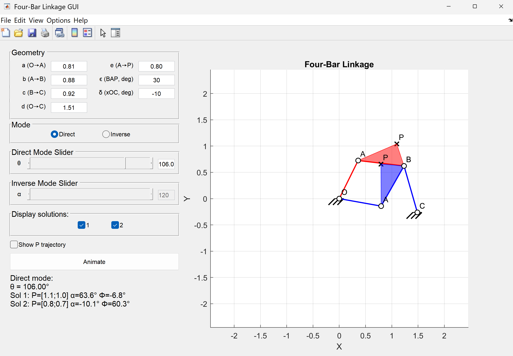</a> 
<a href="./Media/FourbarGUI_octave.png">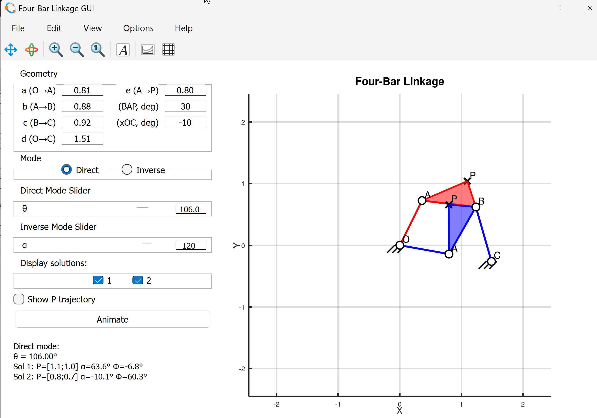</a> 
<a href="./Media/FourbarGUI_python.png">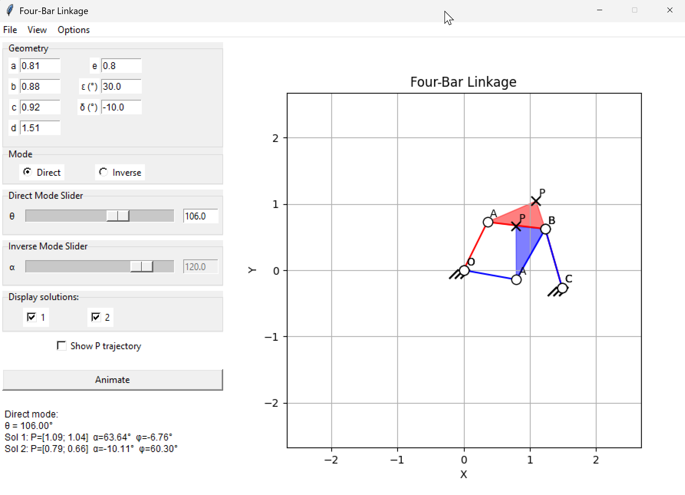</a> 

*Left to right: planar four-bar linkage in Matlab, Octave, and Python.*


| File | Description |
|---|---|
| `fourbar_direct_kinematics.m` | Direct kinematics — given crank angle θ, returns positions of all joints, coupler point P, optional points Q and R, and joint twists for both assembly modes |
| `fourbar_inverse_kinematics.m` | Inverse kinematics — given output link angle α, returns crank angle θ, joint positions, optional points Q and R, and joint twists for both assembly modes |
| `fourbar_plot.m` | Standalone plot function — draws the linkage with ground symbols, joint circles, coupler triangle, P marker, and the optional ternary bodies carrying Q and R |
| `fourbar_gui.m` | Interactive GUI — 900×600 window with geometry inputs, direct/inverse mode, display-solutions checkboxes, P trajectory, animation, session save/load, PNG export |
| `example_fourbar_QR.m` | Example script — direct and inverse kinematics and plots with the optional points Q and R, plus a backward-compatibility check |

**Geometry input** (`geo`): accepts a numeric vector `[a, b, c, d, e, ε, δ]` (backward-compatible with previous versions of this repository) **or** a struct with fields `.a .b .c .d .e .epsilon .delta`. Angles ε and δ in radians. Both assembly modes are always returned (`sol` is 1×2), with `.valid = 0` for a mode that does not assemble.

**Optional points Q and R** (struct form only): point Q is attached to the input crank B-C (`.h_q` = distance B→Q, `.eta_q` = angle C-B-Q) and point R to the output link O-A (`.h_r` = distance O→R, `.eta_r` = angle A-O-R), angles in radians. They are returned in `.Positions.Q` and `.Positions.R` (NaN when the fields are absent, so older code is unaffected) and drawn by `fourbar_plot`.

```matlab
% Vector form
geo = [0.81, 0.88, 0.92, 1.51, 0.80, pi/6, -10*pi/180];
sol = fourbar_direct_kinematics(geo, deg2rad(106));

% Struct form, with the optional points Q and R
geo = struct('a',0.81,'b',0.88,'c',0.92,'d',1.51,'e',0.80,'epsilon',pi/6,'delta',-10*pi/180);
geo.h_q = 0.40;  geo.eta_q = deg2rad(35);    % Q on link B-C
geo.h_r = 0.45;  geo.eta_r = deg2rad(-25);   % R on link O-A
sol = fourbar_direct_kinematics(geo, deg2rad(106));
sol(1).Positions.Q      % point Q, assembly mode 1
fourbar_plot(geo, 'direct', deg2rad(106));
```

### Planar RRR Serial Chain

<a href="./Media/RRRGUI_matlab.png">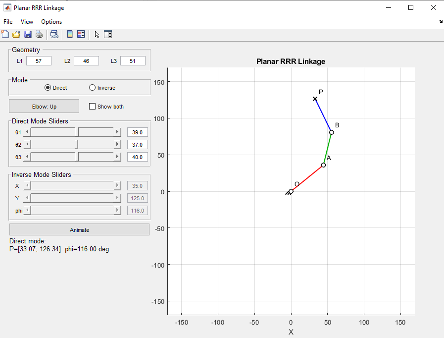</a> 
<a href="./Media/RRRGUI_octave.png">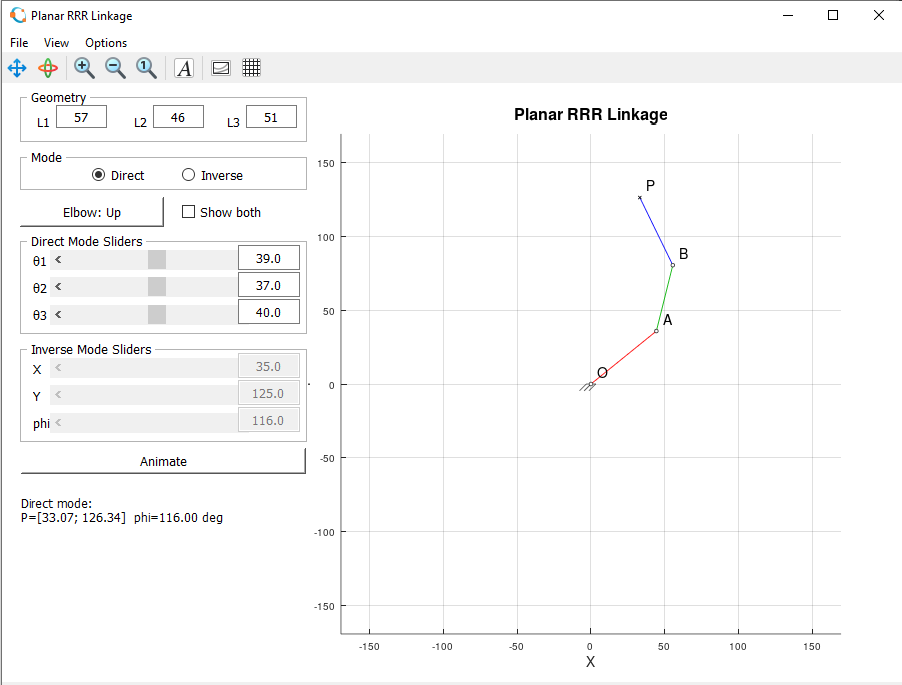</a> 
<a href="./Media/RRRGUI_python.png">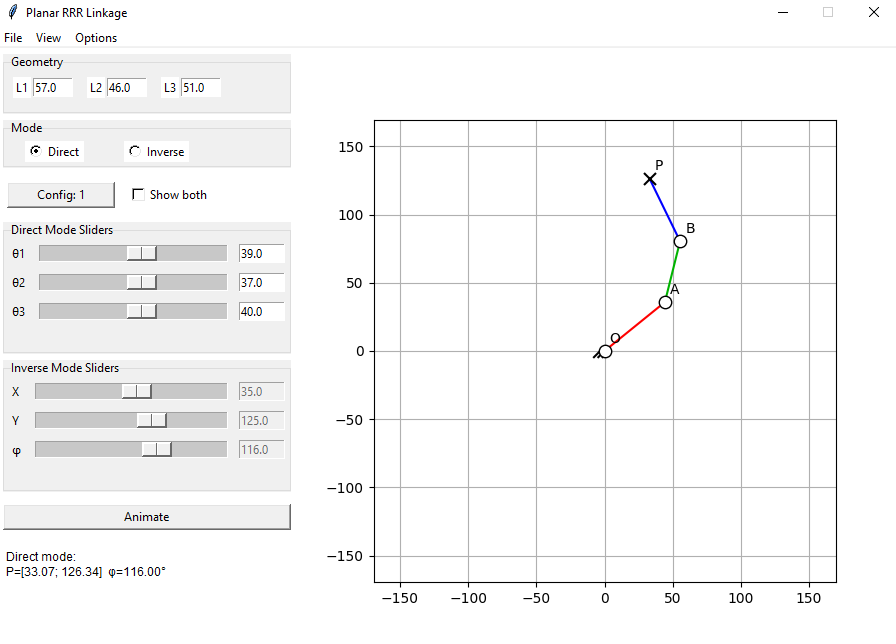</a> 

*Left to right: planar RRR linkage in Matlab, Octave, and Python.*

| File | Description |
|---|---|
| `rrr_direct_kinematics.m` | Direct kinematics — given the joint angles `[θ1, θ2, θ3]`, returns positions O, A, B, P, end-effector orientation φ, and joint twists |
| `rrr_inverse_kinematics.m` | Inverse kinematics — given the target `[Px, Py, φ]`, returns both configurations (1×2: elbow-up, elbow-down) with joint angles and twists |
| `rrr_plot.m` | Standalone plot function — draws three colored links, joint circles, end-effector cross, ground symbol, and labels |
| `rrr_gui.m` | Interactive GUI — direct mode (3 joint sliders), inverse mode (X, Y, φ sliders), config toggle, show-both, animation |

**Geometry input** (`geo`): struct with fields `.L1 .L2 .L3` or numeric vector `[L1, L2, L3]`.

**Changed interface:** the joint angles are now passed as one vector, `rrr_direct_kinematics(geo, theta)`, and the inverse kinematics takes the target as one vector, `rrr_inverse_kinematics(geo, target)`, and returns both elbow configurations at once (the former `elbow_config` argument is gone). In `rrr_plot`, inverse mode takes `[Px Py phi]` and the configuration is selected with `opts.elbow` (+1 or -1).

```matlab
geo = struct('L1', 57, 'L2', 46, 'L3', 51);
sol = rrr_direct_kinematics(geo, deg2rad([39 37 40]));
inv = rrr_inverse_kinematics(geo, [35, 125, deg2rad(116)]);
rad2deg(inv(1).theta)   % elbow-up joint angles (inv(2): elbow-down)
```

### Slider-Crank Linkage

<a href="./Media/SliderCrankGUI_matlab.png">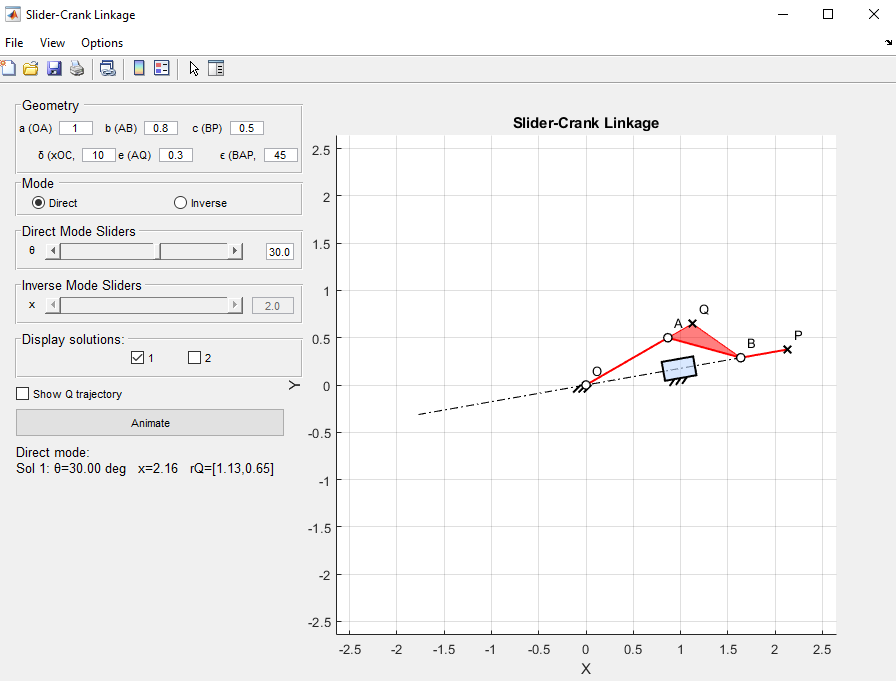</a> 
<a href="./Media/SliderCrankGUI_octave.png">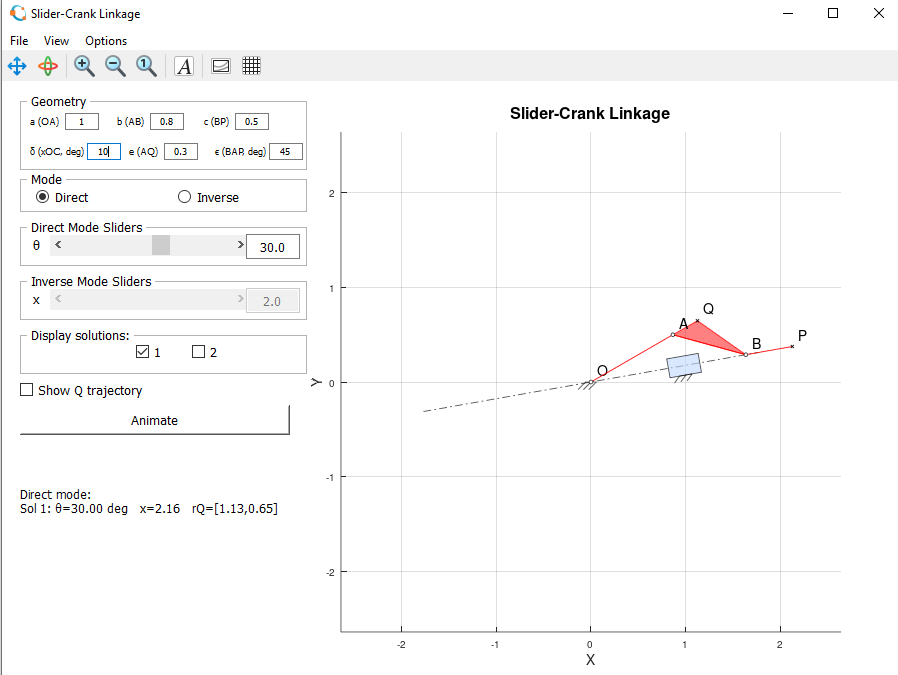</a> 
<a href="./Media/SliderCrankGUI_python.png">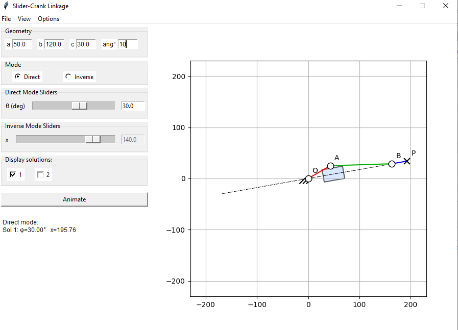</a> 

*Left to right: planar slider crank linkage in Matlab, Octave, and Python.*


| File | Description |
|---|---|
| `slidercrank_direct_kinematics.m` | Direct kinematics — given crank angle φ, returns positions O, A, B, P, optional coupler point Q, and slider displacement x |
| `slidercrank_inverse_kinematics.m` | Inverse kinematics — given slider displacement x (position of B), returns crank angle φ and joint positions |
| `slidercrank_plot.m` | Standalone plot function — draws rail, fixed slider block, linkage in one color per solution, joint circles, P cross |
| `slidercrank_gui.m` | Interactive GUI — direct mode (φ slider), inverse mode (x slider controlling position of P), display-solutions checkboxes, Q trajectory, animation sweeping full stroke, session save/load |

**Geometry input** (`geo`): struct with fields `.a .b .c .slider_angle` or numeric vector `[a, b, c, slider_angle]`. The slider_angle is in radians; c may be negative (places P on the opposite side of B). **Optional point Q** on the coupler A-B (struct form only): `.h_q` = distance A→Q and `.eta_q` = angle from A→B to A→Q (rad), returned in `.Positions.Q`.

```matlab
geo = struct('a', 50, 'b', 120, 'c', 30, 'slider_angle', 0, 'h_q', 60, 'eta_q', deg2rad(20));
sol = slidercrank_direct_kinematics(geo, deg2rad(45), +1);
sol.Positions.Q     % coupler point Q
```

### Five-Bar Linkage

<a href="./Media/FivebarGUI_matlab.png">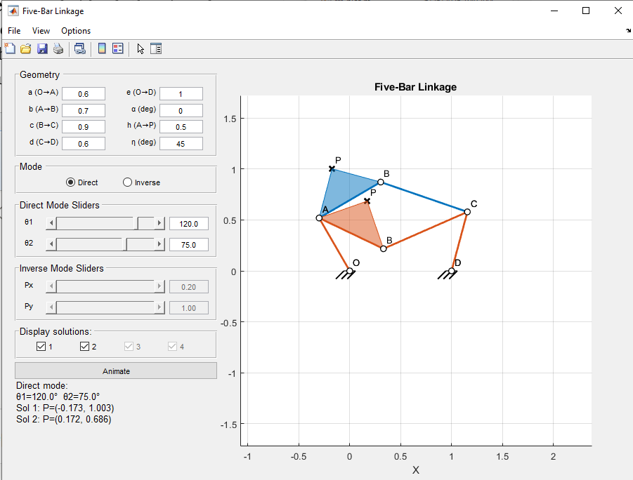</a> 
<a href="./Media/FivebarGUI_octave.png">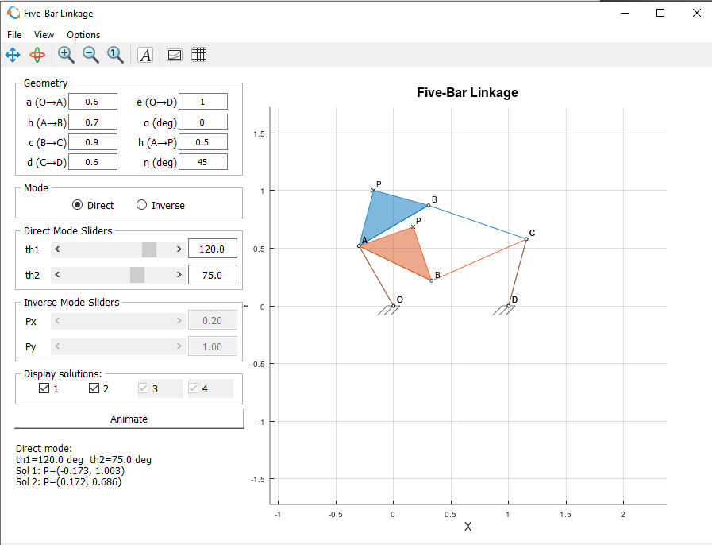</a> 
<a href="./Media/FivebarGUI_python.png">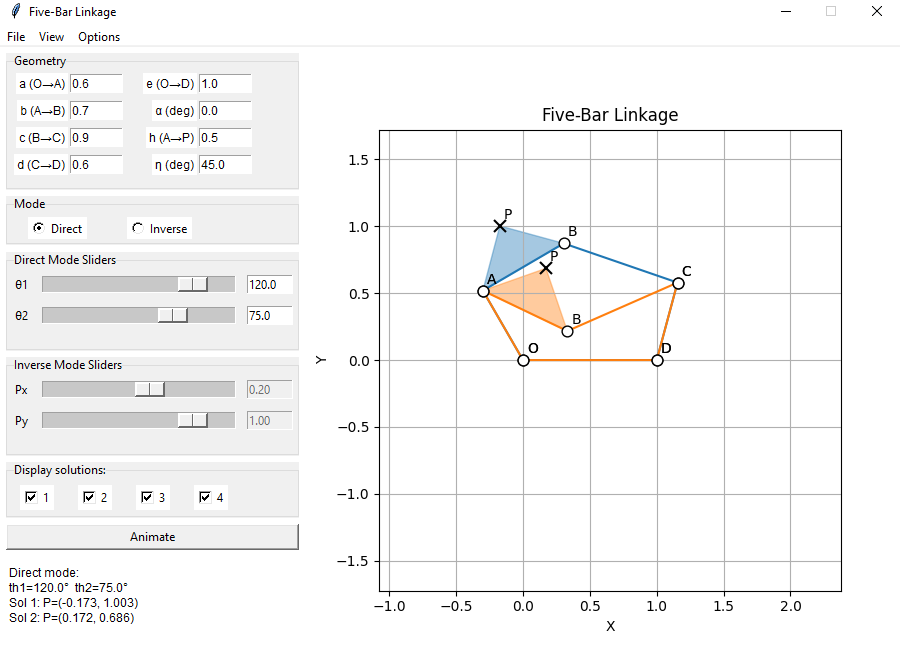</a> 

*Left to right: planar Fivebar linkage in Matlab, Octave, and Python.*


| File | Description |
|---|---|
| `fivebar_direct_kinematics.m` | Direct kinematics — given (θ1, θ2) in degrees, returns positions O, A, B, C, D, P, coupler orientation φ, and joint twists for both assembly modes |
| `fivebar_inverse_kinematics.m` | Inverse kinematics — given desired position of P, returns up to 4 solutions with joint angles (θ1, θ2) and joint twists |
| `fivebar_plot.m` | Standalone plot function — draws linkage chain, coupler triangle A-B-P, joint circles, P cross marker |
| `fivebar_gui.m` | Interactive GUI — 8-parameter geometry, direct mode (θ1/θ2 sliders), inverse mode (Px/Py sliders), 4 solution checkboxes, animation |

**Geometry input** (`geo`): 1×8 numeric vector `[a, b, c, d, e, alpha, h, eta]` **or** a struct with fields `.a .b .c .d .e .alpha .h .eta`: a and d are the input cranks, angles in degrees.

```matlab
geo = [0.6, 0.7, 0.9, 0.6, 1.0, 0, 0.5, 45];   % [a b c d e alpha h eta]
theta = [120, 75];                                 % input crank angles (degrees)
sol = fivebar_direct_kinematics(geo, theta);
% sol(1) and sol(2) are the two assembly modes
disp(sol(1).P)        % coordinates of coupler point P
disp(sol(1).phi)      % orientation of output link (degrees)

% Inverse kinematics: up to 4 solutions
P_des = [0.2; 1.0];
invSol = fivebar_inverse_kinematics(geo, P_des);
```

### Stephenson III Linkage

<a href="./Media/StephensonIIIGUI_matlab.png">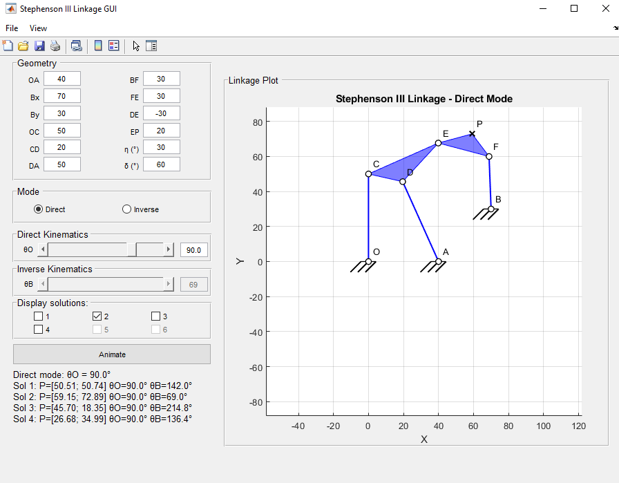</a> 
<a href="./Media/StephensonIIIGUI_octave.png">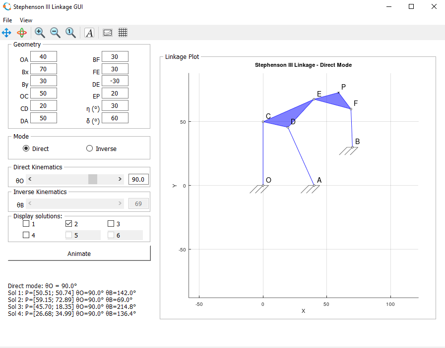</a> 
<a href="./Media/StephensonIIIGUI_python.png">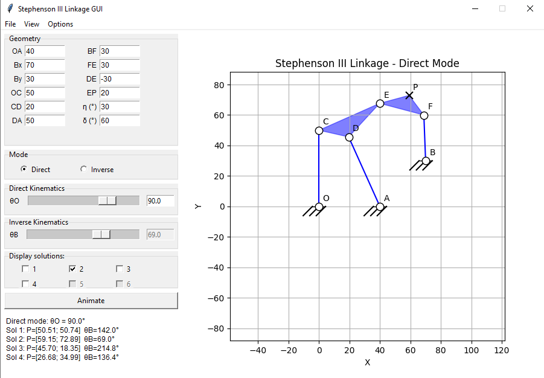</a> 

*Left to right: planar Stephenson III linkage in Matlab, Octave, and Python.*


| File | Description |
|---|---|
| `stephensonIII_direct_kinematics.m` | Direct kinematics — given crank angle θO (deg), returns positions O, A, B, C, D, E, F, P and joint angles for every assembly mode (up to 4) |
| `stephensonIII_inverse_kinematics.m` | Inverse kinematics — given angle θB (deg) of link B-F, returns every real assembly (up to 6), sorted by θO |
| `stephensonIII_plot.m` | Standalone plot function — same graphical style as `fourbar_plot`; optional solution tracking (`opts.track`) keeps each solution in its slot from one call to the next |
| `stephensonIII_gui.m` | Interactive GUI — geometry inputs, direct/inverse mode, 6 display-solutions checkboxes, animation, session save/load |

**Geometry input** (`geo`): 1×12 numeric vector `[OA, Bx, By, OC, CD, DA, BF, FE, DE, EP, η, δ]`, angles η and δ in degrees. Ground pivots O = (0,0), A = (OA,0) and B = (Bx,By); input crank O-C; ternary bodies C-D-E and F-E-P; binary links A-D and B-F. The inverse kinematics returns only real assemblies (all links closing); up to 6 can exist for a given θB. In the GUI, solutions are tracked during animation and slider motion so that each keeps its number and color.

```matlab
geo = [40, 70, 30, 50, 20, 50, 30, 30, -30, 20, 30, 60];
sol = stephensonIII_direct_kinematics(geo, 90);        % up to 4 solutions
inv = stephensonIII_inverse_kinematics(geo, 69);       % every real assembly
[inv.thetaO]                                           % -> 47.24  90.00
stephensonIII_plot(geo, 'inverse', 69);

% A geometry with 6 real inverse solutions
geo6 = [40 70 30 35.7 35.5 26.1 51 57.9 -56 20 30 54.9];
numel(stephensonIII_inverse_kinematics(geo6, 127.07))  % -> 6
```

### Q2 Leg Mechanism

<a href="./Media/Q2LegGUI_matlab.png">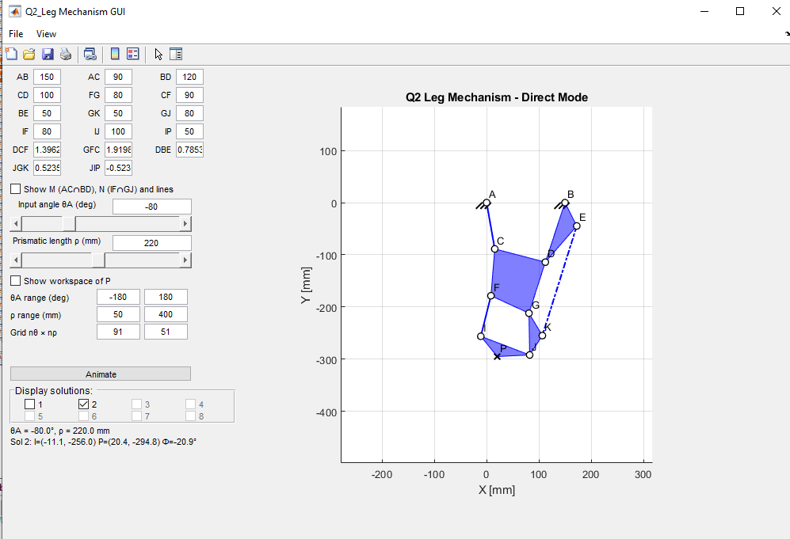</a> 
<a href="./Media/Q2LegGUI_octave.png">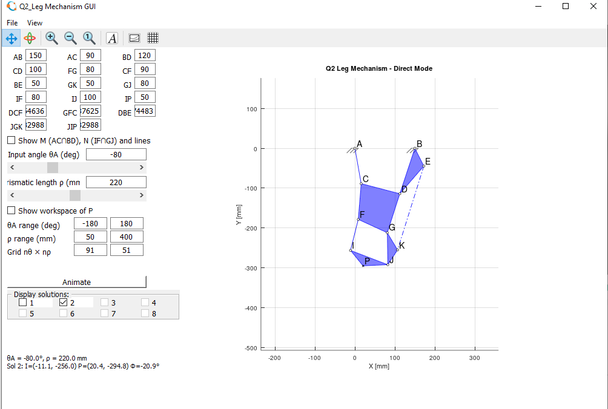</a> 
<a href="./Media/Q2LegGUI_python.png">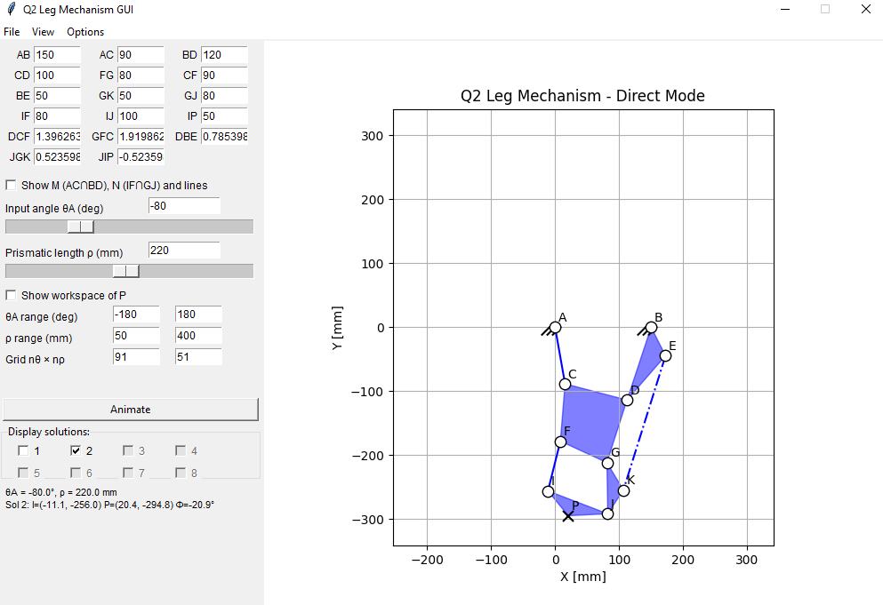</a> 

*Left to right: planar Q2 Leg Mechanism in Matlab, Octave, and Python.*

A planar leg mechanism with two actuators: a crank at A (angle θA) and a prismatic actuator E-K (length ρ). Its links: ground A-B, input crank A-C, ternary body B-D-E, quaternary body C-D-G-F, ternary bodies G-K-J and I-J-P, and link I-F.<br>

This mechanism is proposed and discussed in:<br>
- Birglen, L., Hely, C. (2023). Kinematic Analysis of a Biocompatible Lower Limb Model. In: Okada, M. (eds) Advances in Mechanism and Machine Science. IFToMM WC 2023. Mechanisms and Machine Science, vol 147. Springer, Cham. https://doi.org/10.1007/978-3-031-45705-0_29<br>
- Birglen, L. (2025). A Compliant Q2 Linkage to Model the Human Lower Limb Motion. In: Lanteigne, E., Nokleby, S. (eds) Proceedings of the 2025 CCToMM Symposium on Mechanisms, Machines, and Mechatronics. CCToMM M3 2025. Mechanisms and Machine Science, vol 184. Springer, Cham. https://doi.org/10.1007/978-3-031-95489-4_11

| File | Description |
|---|---|
| `Q2_leg_mechanism_direct_kinematics.m` | Direct kinematics — given θA (rad) and ρ, returns all 8 assembly modes (fixed slots, each with a `.valid` flag): joint positions A…K, point P, angle φ of I→J, and joint twists |
| `Q2_leg_mechanism_plot.m` | Standalone plot function — same graphical style as `fourbar_plot`; optionally draws the line intersections M = (AC)∩(BD) and N = (IF)∩(GJ) with construction lines, and the workspace of P |
| `Q2_leg_mechanism_workspace.m` | Workspace of P — samples θA and ρ within given limits and returns, for each assembly mode, the reachable positions of P and ready-to-plot patch data |
| `Q2_leg_mechanism_gui.m` | Interactive GUI — 17 geometry parameters, θA/ρ sliders, 8 display-solutions checkboxes, M/N construction and distance \|MN\|, workspace display, animation, session save/load |

**Geometry input** (`parameters`): struct with the 17 independent fields `.AB .AC .BD .CD .FG .CF .BE .GK .GJ .IF .IJ .IP` (lengths) and `.DCF .GFC .DBE .JGK .JIP` (angles, in radians). Ground pivots A = (0,0) and B = (AB,0). The inverse kinematics (target position of I) is future work; the GUI currently runs in direct mode only.

```matlab
p = struct('AB',150,'AC',90,'BD',120,'CD',100,'FG',80,'CF',90, ...
           'BE',50,'GK',50,'GJ',80,'IF',80,'IJ',100,'IP',50, ...
           'DCF',deg2rad(80),'GFC',deg2rad(110),'DBE',deg2rad(45), ...
           'JGK',deg2rad(30),'JIP',-deg2rad(30));
sol = Q2_leg_mechanism_direct_kinematics(0, 154, p);   % thetaA = 0, rho = 154
find([sol.valid])                                     % -> all 8 branches assemble
W = Q2_leg_mechanism_workspace(p, deg2rad([-180 180]), [50 400]);
Q2_leg_mechanism_plot(p, 'direct', [0 154], struct('solutions', 2, 'workspace', W));
```

### Spherical RRR Linkage

<a href="./Media/RRRSphericalGUI_matlab.png">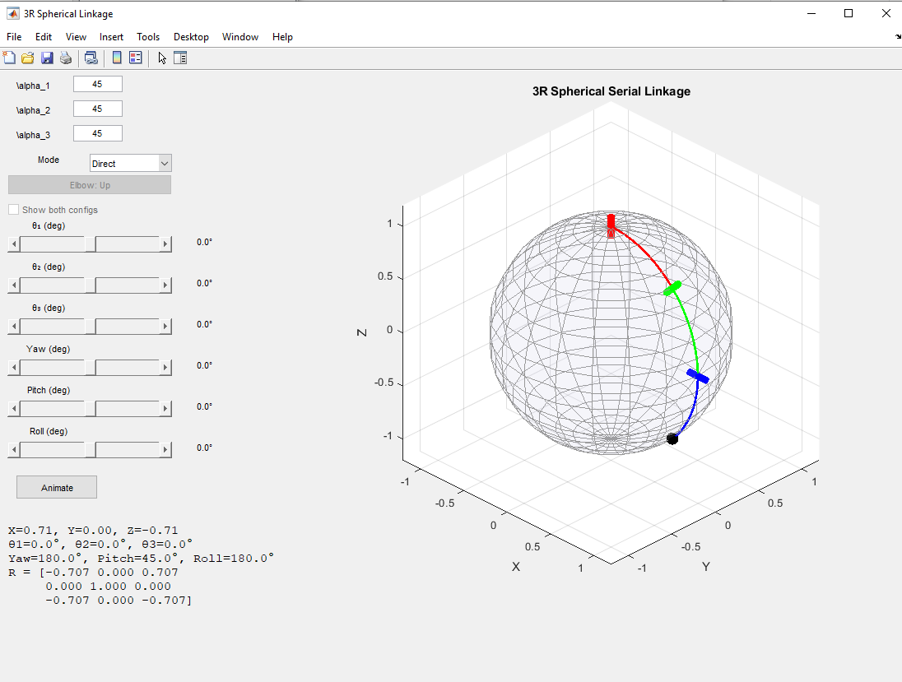</a> 

*WORK IN PROGRESS*

### Spherical fourbar Linkage

<a href="./Media/FourbarSphericalGUI_matlab.png">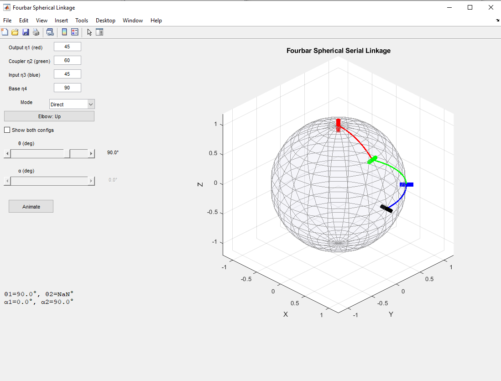</a> 

*WORK IN PROGRESS*


### Running the GUIs

```matlab
fourbar_gui              % Four-Bar Linkage
rrr_gui                  % Planar RRR Serial Chain
slidercrank_gui          % Slider-Crank Linkage
fivebar_gui              % Five-Bar Linkage
stephensonIII_gui        % Stephenson III Linkage
Q2_leg_mechanism_gui     % Q2 Leg Mechanism
rrr_spherical_gui        % Spherical RRR Serial Chain
fourbar_spherical_gui    % Spherical Four-Bar Linkage
```

The four-bar, RRR, slider-crank and five-bar GUIs feature:
- **File menu**: Open / Save session (`.mat`), Export PNG, Export EPS+PDF (MATLAB only), Print (MATLAB only), Exit
- **View menu**: Reset View
- **Options menu**: Toggle Grid
- Compatible with both MATLAB and Octave (Octave disables EPS/PDF export and print)

The Stephenson III and Q2 leg mechanism GUIs feature a **File menu** (Open / Save session, Exit) and a **View menu** (Reset View).

In all planar GUIs, a view zoomed or panned by the user is kept while the linkage moves (sliders, animation).

---

## Python

Requires **Python 3.8+** with `numpy` and `matplotlib`. No other dependencies.

```bash
pip install numpy matplotlib
```

The Python files have not yet been updated with the latest MATLAB changes: in particular, the RRR functions keep the former interface (separate joint angles, one elbow configuration per call), and the optional points Q and R, the twists, and the Stephenson III and Q2 leg mechanisms are MATLAB/Octave only for now.

### Four-Bar Linkage

| File | Description |
|---|---|
| `fourbar_direct_kinematics.py` | Direct kinematics — returns list of 2 solution dicts |
| `fourbar_inverse_kinematics.py` | Inverse kinematics — returns list of 2 solution dicts |
| `fourbar_plot.py` | Plot function — `fourbar_plot(geo, mode, inputs, opts, ax)` |
| `fourbar_gui.py` | Tkinter GUI — matches MATLAB layout |

### Planar RRR Serial Chain

| File | Description |
|---|---|
| `rrr_direct_kinematics.py` | Direct kinematics — returns solution dict |
| `rrr_inverse_kinematics.py` | Inverse kinematics — returns solution dict |
| `rrr_plot.py` | Plot function — `rrr_plot(geo, mode, inputs, opts, ax)` |
| `rrr_gui.py` | Tkinter GUI — matches MATLAB layout |

### Slider-Crank Linkage

| File | Description |
|---|---|
| `slidercrank_direct_kinematics.py` | Direct kinematics — returns solution dict |
| `slidercrank_inverse_kinematics.py` | Inverse kinematics — returns solution dict |
| `slidercrank_plot.py` | Plot function — `slidercrank_plot(geo, mode, inputs, opts, ax)` |
| `slidercrank_gui.py` | Tkinter GUI — matches MATLAB layout |

### Five-Bar Linkage

| File | Description |
|---|---|
| `fivebar_direct_kinematics.py` | Direct kinematics — returns list of 2 solution dicts (one per assembly mode) |
| `fivebar_inverse_kinematics.py` | Inverse kinematics — returns list of 0–4 solution dicts |
| `fivebar_plot.py` | Plot function — `fivebar_plot(geo, mode, inputs, opts, ax)` |
| `fivebar_gui.py` | Tkinter GUI — matches MATLAB layout |

### Running the Python GUIs

```bash
python fourbar_gui.py
python rrr_gui.py
python slidercrank_gui.py
python fivebar_gui.py
```

### Python API Example

```python
import math
import numpy as np
from fourbar_direct_kinematics import fourbar_direct_kinematics
from rrr_inverse_kinematics import rrr_inverse_kinematics
from slidercrank_direct_kinematics import slidercrank_direct_kinematics
from fivebar_direct_kinematics import fivebar_direct_kinematics
from fivebar_inverse_kinematics import fivebar_inverse_kinematics

# Four-bar
geo = np.array([0.81, 0.88, 0.92, 1.51, 0.80, math.pi/6, -10*math.pi/180])
sols = fourbar_direct_kinematics(geo, math.radians(106))
print(sols[0]['P'])  # coupler point for solution 1

# RRR
geo = {'L1': 57, 'L2': 46, 'L3': 51}
sol = rrr_inverse_kinematics(geo, 35, 125, math.radians(116), elbow_config=+1)
print(math.degrees(sol['theta1']))

# Slider-crank
geo = {'a': 50, 'b': 120, 'c': 30, 'slider_angle': 0}
sol = slidercrank_direct_kinematics(geo['a'], geo['b'], geo['c'],
                                    math.radians(45), geo['slider_angle'], config=+1)
print(sol['x_slider'])

# Five-bar
geo = np.array([0.6, 0.7, 0.9, 0.6, 1.0, 0, 0.5, 45])
sols = fivebar_direct_kinematics(geo, [120, 75])
print(sols[0]['P'])      # coupler point, assembly mode 1
print(sols[0]['phi'])    # output link orientation (degrees)

inv = fivebar_inverse_kinematics(geo, [0.2, 1.0])
print(f"{len(inv)} solutions found")
for s in inv:
    print(s['theta'])    # [theta1, theta2] in degrees
```

### Solution Dictionaries

All kinematics functions return dicts (Python) or structs (MATLAB) with a common `Positions` field:

| Field | Description |
|---|---|
| `Positions['O']` | Fixed ground revolute, always `[0, 0]` |
| `Positions['A']` | First moving joint |
| `Positions['B']` | Second moving joint (or slider pin) |
| `Positions['C']` | Second fixed pivot (four-bar only) |
| `Positions['P']` | End-effector / coupler point |
| `valid` | `True` if the configuration is geometrically feasible |

The MATLAB structs may also hold `Positions.Q` / `Positions.R` (optional points of the four-bar and slider-crank) and `Twists` (joint twist coordinates). The Stephenson III and Q2 leg mechanisms use their own joint names, listed in their kinematics files.

---

## GUI Features Summary

- **900 × 600** window
- **Geometry panel** — edit link lengths and angles directly; plot updates on each change
- **Mode selection** — Direct / Inverse radio buttons; switching converts the current pose automatically
- **Direct mode sliders** — control input angles; disabled in inverse mode
- **Inverse mode sliders** — control target position/orientation; disabled in direct mode
- **Display solutions panel** — checkboxes to show/hide each assembly configuration independently, one color per solution
- **Animate button** — starts/stops real-time animation; direct mode rotates joints, inverse mode sweeps through the workspace
- **Info text** — displays current kinematics results (joint angles, end-effector position)
- **Fixed view** — axis limits computed from the geometry, so the view does not move during animation; a user zoom/pan is kept while the linkage moves
- **Session save/load** — `.mat` files (MATLAB/Octave), `.json` files (Python)
- **Export PNG** — saves the current plot at high resolution

---


## License

All files are released under the **GNU Affero General Public License v3.0** — see the [LICENSE](LICENSE) file for details.

## Author

Prof. Lionel Birglen<br/>
Polytechnique Montréal
